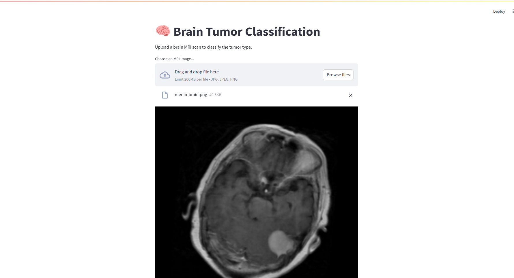
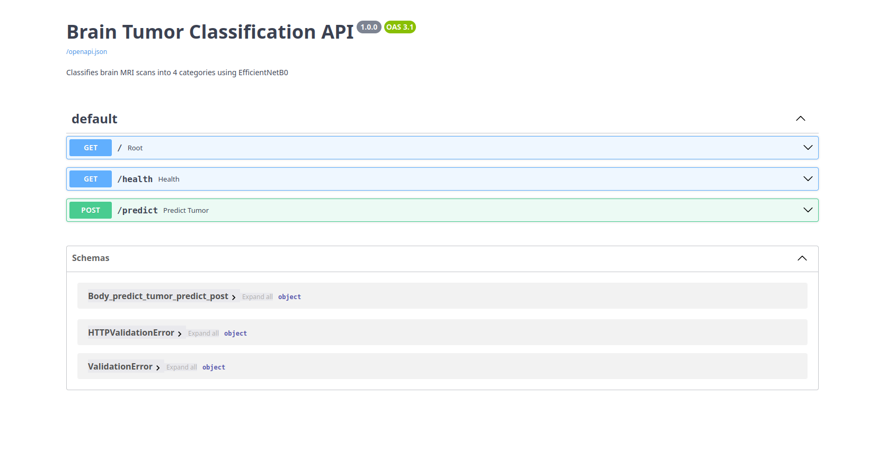

# Brain Tumor MRI Classification

A deep learning project for classifying brain MRI scans into four categories.
The project compares a custom CNN built from scratch against a fine-tuned 
EfficientNetB0 model, with Grad-CAM visualizations to interpret model decisions
and a production-ready REST API with a Streamlit frontend.

---

## Technologies Used

- Python 3
- TensorFlow / Keras for model training and inference
- FastAPI for the REST API backend
- Streamlit for the user-facing frontend
- Docker and Docker Compose for containerized deployment
- pytest for test automation
- GitHub Actions for CI/CD

---

## Demo

### Streamlit Application


### REST API (FastAPI)


---

## Results

| Model | Test Accuracy | Macro F1 | Parameters |
|---|---|---|---|
| CNN from Scratch | 76.8% | 0.75 | 454K |
| EfficientNetB0 Transfer Learning | 91.8% | 0.92 | 4.2M |

### Per-Class Performance — EfficientNetB0

| Class | Precision | Recall | F1 |
|---|---|---|---|
| Glioma | 0.96 | 0.74 | 0.84 |
| Meningioma | 0.86 | 0.94 | 0.90 |
| No Tumor | 0.90 | 1.00 | 0.95 |
| Pituitary | 0.96 | 0.99 | 0.97 |

---

## Grad-CAM Visualizations

Grad-CAM reveals which regions the model focuses on when making predictions.
For correct predictions, the model attends to anatomically relevant regions.
For misclassified glioma cases, the model either focuses on image artifacts
or confuses the tumor region with meningioma due to visual overlap.

---

## Key Findings

**CNN from Scratch:** Achieved 76.8% test accuracy. Confusion matrix analysis
revealed a critical failure mode — 31% of meningioma cases were misclassified
as no tumor (false negatives). This is clinically dangerous and motivated the
move to transfer learning.

**Transfer Learning (EfficientNetB0):** Fine-tuned in two phases. Phase 1
trained only the classification head (frozen base, lr=1e-3, 20 epochs).
Phase 2 unfroze the last 20 layers for fine-tuning (lr=1e-5, 10 epochs).
Meningioma recall improved from 49% to 94%. Glioma remains the hardest class
(74% recall) due to its heterogeneous appearance and infiltrative borders.

**Grad-CAM:** Confirmed the model attends to anatomically relevant regions
for correct predictions. A watermark was detected in one notumor sample,
which the model partially focused on — a data quality concern worth noting.

---

## Project Structure

```
brain-tumor-classification/
├── .github/
│   └── workflows/
|       └──ci.yml
├── notebooks/
│   ├── 01_EDA.ipynb
│   ├── 02_preprocessing.ipynb
│   ├── 03_cnn_from_scratch.ipynb
│   ├── 04_transfer_learning.ipynb
│   └── 05_gradcam.ipynb
├── src/
│   ├── __init__.py
│   ├── config.py
│   ├── preprocessing.py
│   └── inference.py
├── api/
│   ├── main.py
│   ├── schemas.py
│   └── requirements.txt
├── frontend/
│   ├── requirements.txt
│   └── streamlit_app.py
├── docker/
│   ├── Dockerfile.api
│   ├── Dockerfile.frontend
│   └── docker-compose.yml
├── models/
│   └── transfer_best_phase2.keras
├── tests/
│   ├── test_api.py
│   ├── test_inference.py
│   └── test_preprocessing.py
├── docs/
├── conftest.py
├── requirements.txt
└── README.md
```

---

## Dataset

Brain Tumor MRI Dataset — 7,200 MRI images across 4 balanced classes,
split into 5,600 training and 1,600 testing images.

Source: https://www.kaggle.com/datasets/masoudnickparvar/brain-tumor-mri-dataset


---

## Setup

### Option 1: Local (without Docker)

```bash
git clone https://github.com/<your-username>/brain-tumor-classification.git
cd brain-tumor-classification
python -m venv .venv
source .venv/bin/activate
pip install -r requirements.txt
```

Place the trained model at `models/transfer_best_phase2.keras`.

Run the API:
```bash
uvicorn api.main:app --reload --host 0.0.0.0 --port 8000
```

Run the frontend (separate terminal):
```bash
streamlit run frontend/streamlit_app.py
```

### Option 2: Docker

```bash
cd docker
docker-compose up --build
```

| Service | URL |
|---|---|
| REST API | http://localhost:8000 |
| API Documentation | http://localhost:8000/docs |
| Streamlit Frontend | http://localhost:8501 |


---

## CI/CD

The project uses GitHub Actions for continuous integration.
On every push to `main`, the pipeline runs:

1. Installs dependencies
2. Runs the full test suite (`pytest tests/ -v`)
3. Builds both Docker images to verify they compile correctly

Workflow file: `.github/workflows/ci.yml`

---

## Tests

```bash
pip install pytest httpx
pytest tests/ -v
```

The test suite covers:
- Preprocessing: input shape, pixel range, grayscale conversion
- Inference: output keys, valid class names, probability sum
- API: root endpoint, health check, valid image prediction, invalid file rejection

---

## Preprocessing Decisions

| Decision | Choice | Reason |
|---|---|---|
| Resize (scratch) | 150x150 | Faster training on limited GPU |
| Resize (transfer) | 224x224 | Standard EfficientNetB0 input size |
| Color mode (scratch) | Grayscale | Medically appropriate for MRI |
| Color mode (transfer) | RGB | Required by pretrained architecture |
| Normalization (scratch) | 0-1 | Standard for custom CNNs |
| Normalization (transfer) | 0-255 | EfficientNet applies internal normalization |
| Augmentation | Rotation ±15°, Zoom 10%, Contrast 10% | Medically plausible variations only |
| Validation split | 15% stratified | Preserves class balance |

---

## Limitations

- Single MRI sequence (T1) only. Clinical diagnosis typically uses T1, T2,
  FLAIR, and contrast-enhanced T1 together.
- Glioma heterogeneity remains a challenge due to its infiltrative borders
  and variable appearance across patients.
- Dataset contains watermarked images in the notumor class.

## Potential Improvements

- Focal loss to focus training on hard examples (glioma)
- Class-weighted loss to penalize false negatives in tumor classes
- Multi-modal MRI input (T1 + T2 + FLAIR)
- Segmentation model (U-Net) to locate tumor boundaries
- Larger or more diverse dataset for glioma specifically